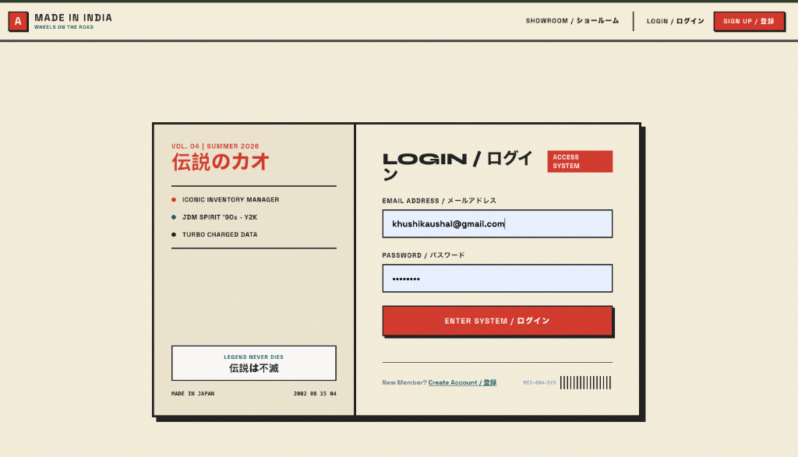
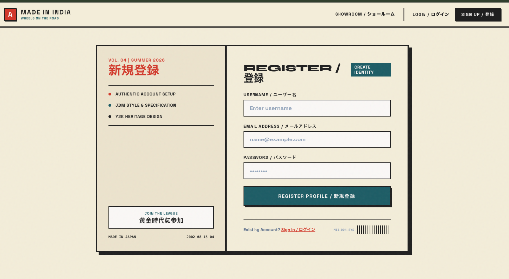
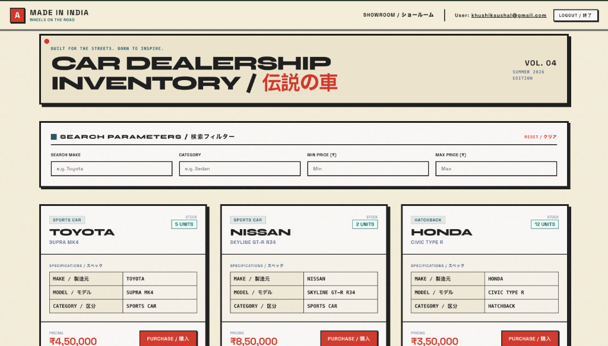
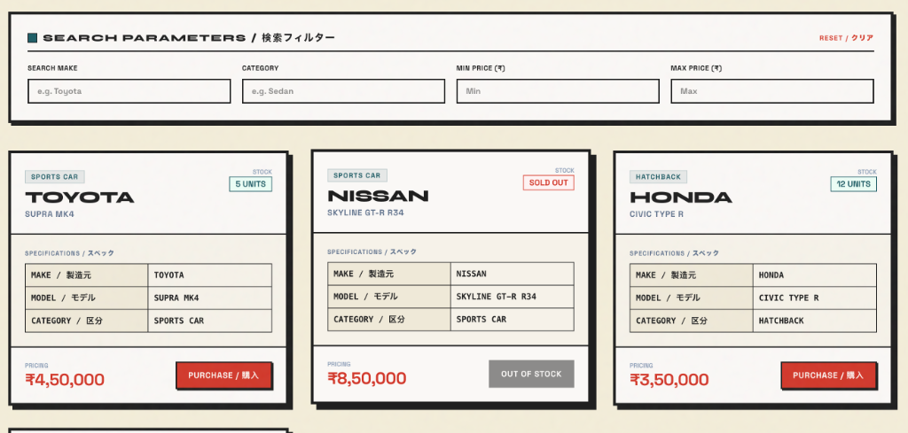
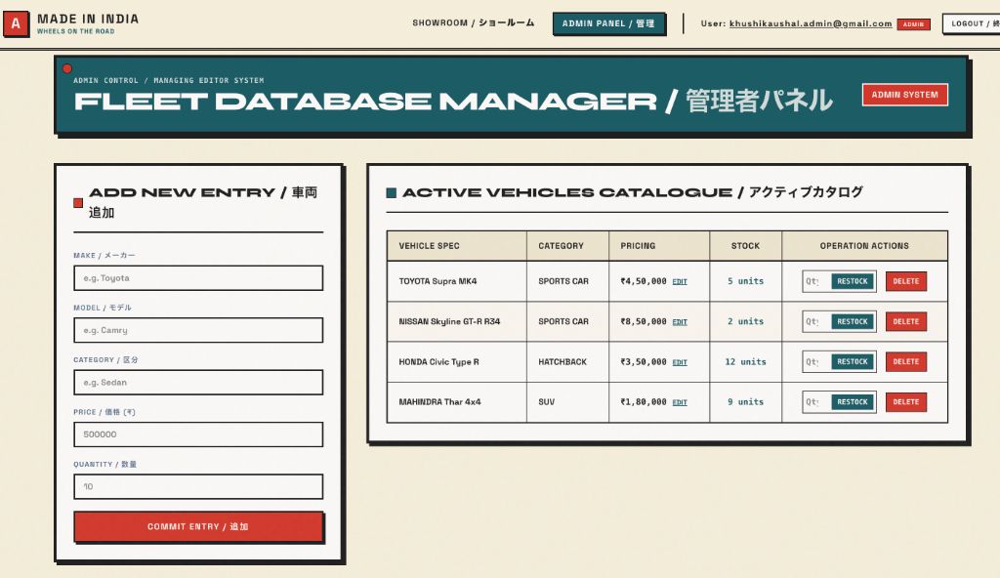

# Car Dealership Inventory System

A full-stack car dealership inventory management system — built as a TDD kata covering authentication, vehicle inventory CRUD, search/filtering, and purchase/restock workflows, backed by a tested REST API.

## Features

- User registration and login secured with JWT authentication
- Role-based access — regular users can browse and purchase, admins can add/update/delete/restock vehicles
- Full vehicle CRUD with search by make, model, category, and price range
- Purchase flow that respects stock levels (disabled once a vehicle is out of stock)
- Backend built test-first with pytest — see the Test Report section below

## Tech Stack

**Backend:** FastAPI (Python), SQLAlchemy + SQLite, JWT auth (python-jose), bcrypt password hashing, pytest for testing  
**Frontend:** React (Vite), Tailwind CSS, React Router, Axios

## Project Structure

```
car-dealership-inventory/
├── backend/
│   ├── app/
│   │   ├── api/          # route handlers (auth, vehicles)
│   │   ├── core/         # JWT + security utilities
│   │   ├── models/       # SQLAlchemy models
│   │   ├── schemas/      # Pydantic request/response schemas
│   │   └── database.py
│   ├── tests/            # pytest test suite
│   ├── main.py
│   └── requirements.txt
└── frontend/
    ├── src/
    └── package.json
```

## Setup & Run Locally

### Prerequisites
- Python 3.10+
- Node.js 18+

### Backend

```bash
cd backend
python -m venv venv
source venv/bin/activate
pip install -r requirements.txt
```

Create a `.env` file inside `backend/` with:
```
JWT_SECRET=your_own_secret_key_here
```

Start the API:
```bash
uvicorn main:app --reload
```
The backend runs at `http://localhost:8000`. Interactive API docs are available at `http://localhost:8000/docs`.

### Frontend

In a separate terminal:
```bash
cd frontend
npm install
npm run dev
```
The frontend runs at `http://localhost:5173`.

### Admin Access

To create an Admin user, register normally via the UI, then update the database directly:
```bash
cd backend
source venv/bin/activate
python -c "
from app.database import SessionLocal
from app.models.user import User
db = SessionLocal()
user = db.query(User).filter(User.email == 'your@email.com').first()
user.role = 'admin'
user.is_admin = True
db.commit()
print('Admin promoted successfully.')
"
```

## API Endpoints

| Method | Endpoint | Access | Description |
|---|---|---|---|
| POST | `/api/auth/register` | Public | Register a new user |
| POST | `/api/auth/login` | Public | Log in, returns JWT |
| POST | `/api/vehicles` | Authenticated | Add a new vehicle |
| GET | `/api/vehicles` | Authenticated | List all vehicles |
| GET | `/api/vehicles/search` | Authenticated | Search by make/model/category/price range |
| PUT | `/api/vehicles/:id` | Authenticated | Update a vehicle |
| DELETE | `/api/vehicles/:id` | Admin only | Delete a vehicle |
| POST | `/api/vehicles/:id/purchase` | Authenticated | Purchase a vehicle, decrements quantity |
| POST | `/api/vehicles/:id/restock` | Admin only | Restock a vehicle, increments quantity |

## Screenshots

**Login page**


**Register page**


**Dashboard — vehicle listing**


**Purchase button disabled when out of stock**


**Admin panel — add/edit/delete/restock vehicles**


## My AI Usage

**Tools used:** ChatGPT, VS Code (native Copilot), Claude AI-DLC, and Antigravity — used throughout the backend and frontend build for test generation, boilerplate, debugging, and documentation drafting.

**How I used them:**

- **Test-first workflow:** For each endpoint (register, login, vehicle CRUD, search, purchase, restock), I prompted the AI to write pytest test cases *before* any implementation existed, then asked for the minimal implementation needed to make those tests pass — a strict Red-Green-Refactor cycle.
- **Security review:** I asked the AI to review the implementation after it was working, which surfaced issues I then fixed manually — including an admin-escalation vulnerability in the registration flow and a hardcoded JWT secret that needed to move into an environment variable.
- **Debugging:** When tests failed, I pasted the exact error and relevant code and asked the AI to explain the cause before applying any fix.
- **Frontend scaffolding:** Used the AI to scaffold React components (auth forms, dashboard, admin panel) against the already-working API, then adjusted styling, state handling, and edge cases (like 422 error parsing) manually.
- **Documentation:** Used AI to draft the initial structure of this README and the PROMPTS.md file, then edited them to accurately reflect what actually happened during development.

**Reflection:** AI significantly sped up boilerplate — test scaffolding, route structure, React components. But the business-logic edge cases (stock going negative, role-based access, the admin self-escalation bug) still needed a manual review pass; a couple of those slipped through the first AI-generated implementation and were only caught by explicitly asking for a security-focused review afterward. That's the main lesson: AI-generated code still needs an adversarial second look, not just a test-passing check.

## Test Report

Backend test suite (`pytest -v`), run from `backend/`:

```
============================= test session starts ==============================
platform darwin -- Python 3.14.2, pytest-9.1.1, pluggy-1.6.0
collected 14 items

tests/test_auth.py::test_register_success PASSED                         [  7%]
tests/test_auth.py::test_register_password_is_hashed PASSED              [ 14%]
tests/test_auth.py::test_register_cannot_self_promote_to_admin PASSED    [ 21%]
tests/test_auth.py::test_register_duplicate_email_returns_400 PASSED     [ 28%]
tests/test_auth.py::test_register_duplicate_username_returns_400 PASSED  [ 35%]
tests/test_auth.py::test_register_missing_required_field_returns_422 PASSED [ 42%]
tests/test_auth.py::test_register_password_too_short_returns_422 PASSED  [ 50%]
tests/test_auth.py::test_login_success_returns_jwt PASSED                [ 57%]
tests/test_auth.py::test_login_wrong_password_returns_400 PASSED         [ 64%]
tests/test_vehicles.py::test_create_vehicle_unauthorized PASSED          [ 71%]
tests/test_vehicles.py::test_create_vehicle_authorized PASSED            [ 78%]
tests/test_vehicles.py::test_purchase_decrements_quantity PASSED         [ 85%]
tests/test_vehicles.py::test_restock_requires_admin PASSED               [ 92%]
tests/test_vehicles.py::test_search_update_delete_vehicle PASSED         [100%]

======================== 14 passed, 1 warning in 3.64s =========================
```

Reproduce locally with:
```bash
cd backend
source venv/bin/activate
pytest -v
```

## Live Demo

- **Frontend:** [car-dealership-inventory-wine.vercel.app](https://car-dealership-inventory-wine.vercel.app/)
- **Backend API:** [car-dealership-inventory-vm5k.onrender.com](https://car-dealership-inventory-vm5k.onrender.com)

> **Note:** The backend is on Render's free tier, so the first request after inactivity can take 30–60 seconds to wake up — that's expected, not a bug.
